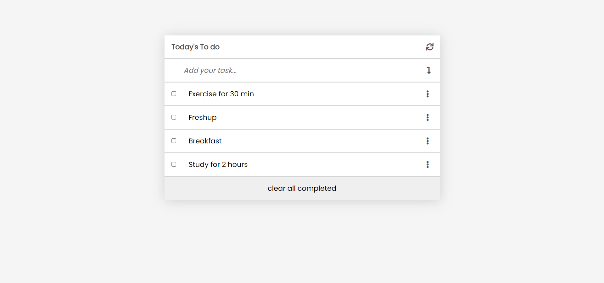

# To-Do-list
This project is part of the 2nd Module 2 Block of Microverse curriculum. The main objective is to use webpack to bundle JavaScript, learn how to use proper ES6 syntax, use ES6 modules to write modular JavaScript, and learn how to use JavaScript objects and arrays and dynamically modify the DOM and add basic events. This will follow professional guidelines in responsive design.

This project will be a basic website that allows users to add, modify and remove a list of To Do tasks.

# Built With

. HTML

.CSS
    
.Javascript
    
.HTML& CSS & Javaascript Linters
    
.Git
    
.Es6
    
.WebPack

## Video

In the following [link](Coming Soon)

## Live Server

In the following link, you can view (https://ravitejam9602.github.io/To_Do_List_Application/)).

## Screenshot

# Test

Download all the dependencies run:

npm install

# Run webpack server

npm run start

# Run build

npm run build

# Getting Started

Please get your browser update. To get a local copy up and running follow these simple steps.

Run the command below from the Terminal:

navigate to your projects folder

run git clone (git@github.com:RaviTejaM9602/To_Do_List_Application.git) in your terminals

start index.html

# Authors

👤 Author

- GitHub: [github](https://github.com/RaviTejaM9602)

- Twitter: [twitter](https://twitter.com/home)

- LinkedIn: [Linkdin](https://www.linkedin.com/in/ravi-teja-8499a31b9/)

🤝 Contributing

Contributions, issues, and feature requests are welcome!

Feel free to check the [issues page](https://github.com/microverseinc/readme-template/issues). 

# Show your support

Give a ⭐️ if you like this project! Acknowledgments

Entire Microverse team
My learning and coding partners

📝 License

This project is [MIT](https://github.com/microverseinc/readme-template/blob/master/MIT.md) licensed.
